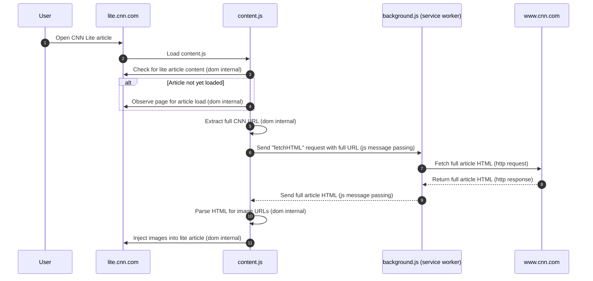

# Chrome/Edge extention to add images to cnnlite.com articles

## Setup

1. Open Chrome or Edge browser.

1. Type chrome://extensions (for Chrome) or edge://extensions (for Edge) in the address bar and press Enter.

1. In the top-right corner, enable "Developer mode" by toggling the switch.

1. Click on the "Load unpacked" button that appears.

1. Navigate to the folder containing your extension files (manifest.json, content.js, background.js) and select it.

1. Click "Select Folder" (or equivalent) to load the extension.

The extension should now appear in your list of installed extensions. You may need to pin the extension to the toolbar for easy access.

## Result

## Architecture

